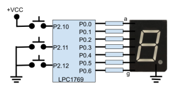

**EJERCICIO N° 1: (35 %)**

Utilizando Systick e interrupciones externas escribir un código en C que cuente indefinidamente de 0 a 9. Un pulsador conectado a Eint0 reiniciará la cuenta a 0 y se mantendrá en ese valor mientras el pulsador se encuentre presionado. Un pulsador conectado a Eint1 permitirá detener o continuar la cuenta cada vez que sea presionado. Un pulsador conectado a Eint2 permitirá modificar la velocidad de incremento del contador. En este sentido, cada vez que se presione ese pulsador el contador pasará a incrementar su cuenta de cada 1 segundo a cada 1 milisegundo y viceversa. Considerar que el microcontrolador se encuentra funcionando con un reloj (cclk) de 16 Mhz. El código debe estar debidamente comentado y los cálculos realizados claramente expresados. En la siguiente figura se muestra una tabla que codifica el display y el esquema del hardware sobre el que funcionará el programa.

**Tabla: Código 7 Segmentos Cátodo Común**

| Numero | g | f | e | d | c | b | a | Hex |
| :--- | :-: | :-: | :-: | :-: | :-: | :-: | :-: | :--- |
| 0 | 0 | 1 | 1 | 1 | 1 | 1 | 1 | 3F |
| 1 | 0 | 0 | 0 | 0 | 1 | 1 | 0 | 06 |
| 2 | 1 | 0 | 1 | 1 | 0 | 1 | 1 | 5B |
| 3 | 1 | 0 | 0 | 1 | 1 | 1 | 1 | 4F |
| 4 | 1 | 1 | 0 | 0 | 1 | 1 | 0 | 66 |
| 5 | 1 | 1 | 0 | 1 | 1 | 0 | 1 | 6D |
| 6 | 1 | 1 | 1 | 1 | 1 | 0 | 1 | 7D |
| 7 | 0 | 0 | 0 | 0 | 1 | 1 | 1 | 07 |
| 8 | 1 | 1 | 1 | 1 | 1 | 1 | 1 | 7F |
| 9 | 1 | 1 | 1 | 0 | 1 | 1 | 1 | 67 |

