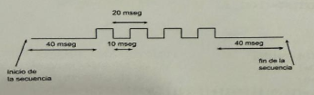

# Consigna

Utilizando Systick, programar la LPC1769 para que cada vez que se produzca una interrupción por flanco descendente en EINT2 se saque por el pin P2.4 la secuencia mostrada en la figura.   
En caso que se produzca una nueva interrupción por EINT2 mientras se está realizando la secuencia, se pondrá en uno la salida P2.4 y se dará por finalizada la secuencia.   
El programa NO debe hacer uso de retardos por software y deben enmascararse los pines del puerto 2 que no van a ser utilizados. Suponer una frecuencia de reloj cclk de 60Mhz (NO se pide configuración del reloj). Se pide el programa completo debidamente comentado y los respectivos cálculos de tiempo asignados al Systick.

